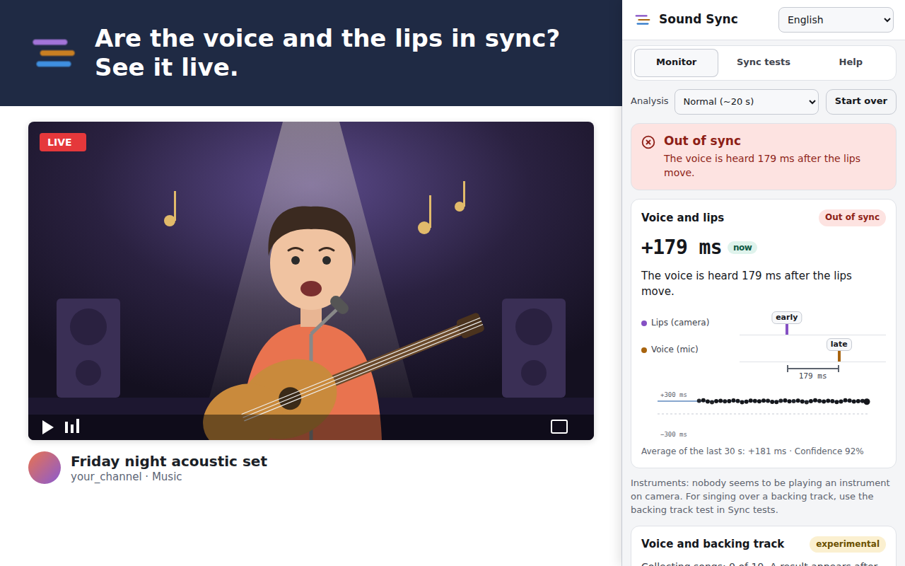
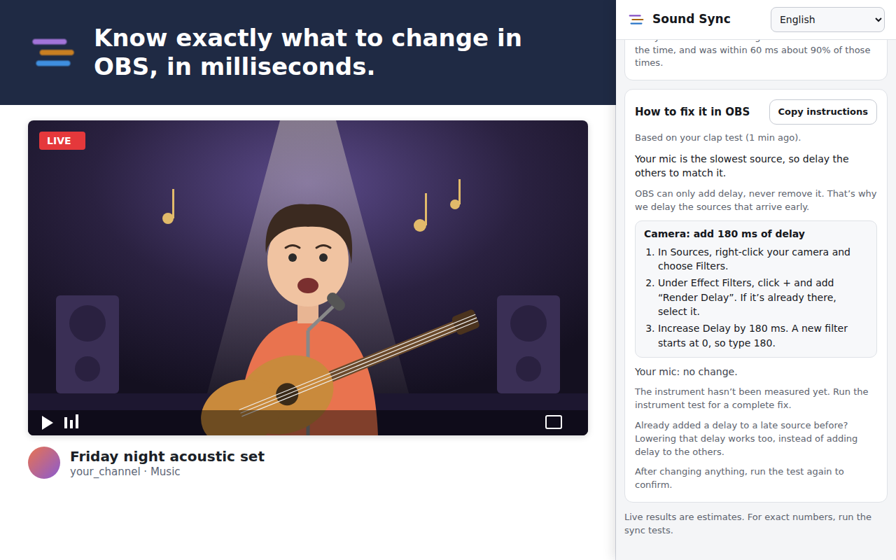
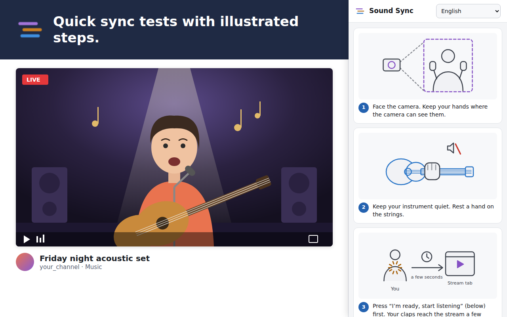

<div align="center">


# Sound Sync

**Is your music stream in sync?**<br>
Find out if the voice, lips, instruments and backing track of a live stream line up, and get step-by-step OBS fixes.

[](https://github.com/lucasbaesso/sound-sync/releases/latest)
[](LICENSE)


**English** · [🇧🇷 Português](README.pt-BR.md)

[**Download**](https://github.com/lucasbaesso/sound-sync/releases/latest) · [Install](#install) · [How to use](#how-to-use) · [FAQ](#faq)



</div>

## Why

When you stream music, your camera, mic, instruments and backing track all travel through different paths, and each one can arrive a little late. Viewers notice when the singing doesn't match the lips, but it's hard to tell **what** is late and **by how much** while you're the one performing.

Sound Sync watches your stream the way a viewer does, in a browser tab, and tells you in plain words:

> *"The voice is heard 179 ms after the lips move."*
> **Fix:** In OBS, add a Render Delay of 180 ms to your camera.

## Features

| | |
|---|---|
| 🎤 **Voice and lips, live** | Tracks the singer's mouth and compares it with the voice, while the stream plays. |
| 👏 **Clap test** | Mic vs camera, accurate to about one video frame. |
| 🎸 **Instrument test** | Instrument input vs camera, with a strike on the strings. |
| 🎧 **Backing track test** | Voice vs backing track, using a click track. Accurate to about ±1 ms. |
| 🛠️ **OBS fixes** | Which source to delay (Render Delay or Sync Offset) and by how many milliseconds. Copy the steps with one click. |
| 🖼️ **Illustrated steps** | Every test explains what to do with pictures, in English and Portuguese. |
| 🔒 **Private** | Everything is analyzed on your computer. No account, no tracking, no uploads. |
| ⚙️ **Light on your PC** | Choose whether it may use the graphics card, so your stream or game doesn't stutter. |

Works with **Twitch, YouTube, TikTok, Instagram, Kick, Facebook** and any tab playing video, live or recorded. You can also check an OBS recording by opening the file in a tab.

## Screenshots

| | |
|:---:|:---:|
|  |  |
| **How to fix it in OBS** | **Illustrated sync tests** |

<sub>The stream in these images is an illustration; the side panel is the real extension.</sub>

## Install

> Sound Sync isn't in the Chrome or Edge store yet. Until then, install it from the zip. It takes about a minute.

1. Download **`sound-sync-<version>.zip`** from the [latest release](https://github.com/lucasbaesso/sound-sync/releases/latest).
2. Unzip it into a folder you'll keep, for example `Documents\Sound Sync`. Don't delete or move it later: the browser loads the extension from there.
3. Open `chrome://extensions` in Chrome, or `edge://extensions` in Edge.
4. Turn on **Developer mode**.
5. Click **Load unpacked** and choose the folder that contains `manifest.json`.
6. Click the 🧩 puzzle icon in the toolbar, pin **Sound Sync**, and click it to open the side panel.

**To update:** download the new zip, replace the files in your folder, and click ↻ on Sound Sync in `chrome://extensions`.

## How to use

1. **Open your stream** (live or a VOD) in a tab and play it at normal speed.
2. In the side panel, click **Choose the stream tab**, pick that tab and keep **Also share tab audio** on.
3. **Monitor** shows live results after about 20 seconds of singing on camera.
4. For exact numbers, open **Sync tests** and run the clap, instrument or backing track test while you're live (a private or unlisted test stream works).
5. Follow **How to fix it in OBS**, then run the test again to confirm.

### What "early" and "late" mean

"Late" means it arrives after it should. If the **voice is late**, viewers see your lips move first and hear the words a moment later. OBS can only add delay, so Sound Sync always tells you to **delay the sources that arrive early** until everything matches the latest one.

Results are *sound minus picture*: **+** means the sound is late, **−** means it's early. Viewers notice early sound sooner than late sound.

| Result | Usually feels | What to do |
|---|---|---|
| −40 to +60 ms | In sync | Nothing |
| −90 to +125 ms | Slightly off | Fix if you can |
| Beyond that | Clearly out of sync | Follow the OBS steps |

<sub>Thresholds follow the broadcast recommendations EBU R37 and ITU-R BT.1359.</sub>

## FAQ

<details>
<summary><b>Does it work on my viewers' side or on mine?</b></summary>

Either. It analyzes whatever the tab shows, so it measures what viewers really get. Open your own stream in a tab (on the same or another computer) while you're live, or open a VOD afterwards.
</details>

<details>
<summary><b>Can it tell if my voice matches the backing track automatically?</b></summary>

Not reliably in a few seconds: when voice and music are already mixed into one track, there's no reliable way to know where the singer meant to be. Use the **backing track test** for an exact number. An experimental estimate that combines a whole stream (about 12 songs) is in the Monitor tab. The research behind this is in [reports/](reports/).
</details>

<details>
<summary><b>Does it slow down my stream?</b></summary>

It's light, but if OBS or a game stutters, turn off **Use the graphics card (GPU)** in Help → Performance. You can also turn off AI voice separation there. Running it on a second computer avoids any impact.
</details>

<details>
<summary><b>Is anything uploaded?</b></summary>

No. Picture, sound, face tracking and voice separation are all processed on your computer. The extension blocks every network request. See the [privacy policy](PRIVACY.md).
</details>

<details>
<summary><b>Why does it ask to share a tab?</b></summary>

That's how a browser extension gets a tab's picture and sound. The browser asks you which tab to share, and you can stop at any time.
</details>

## Contributing

Bug reports and ideas are welcome: [open an issue](https://github.com/lucasbaesso/sound-sync/issues). For a timing problem, say which site, whether it was live or a VOD, and what the panel showed (a screenshot helps).

To build from source, run the tests or learn how the measurements work, see **[docs/DEVELOPMENT.md](docs/DEVELOPMENT.md)**.

```bash
git clone https://github.com/lucasbaesso/sound-sync.git
cd sound-sync
npm install
npm run fetch-models   # face model and voice separation models
npm run build          # extension in dist/, load it with "Load unpacked"
```

## License

[MIT](LICENSE) © Lucas Baesso. Bundled libraries and models are open source too (Apache 2.0, MIT, BSD-3-Clause, ISC): see [THIRD_PARTY_NOTICES.txt](public/THIRD_PARTY_NOTICES.txt).
