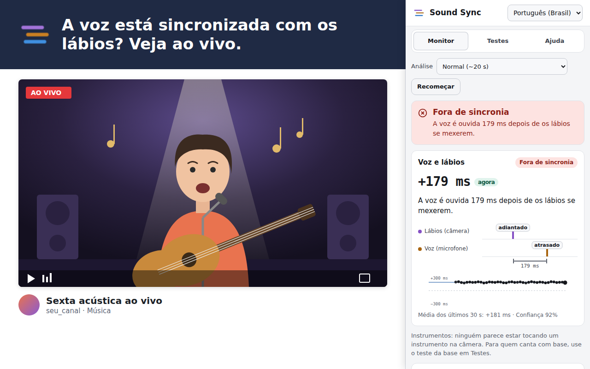
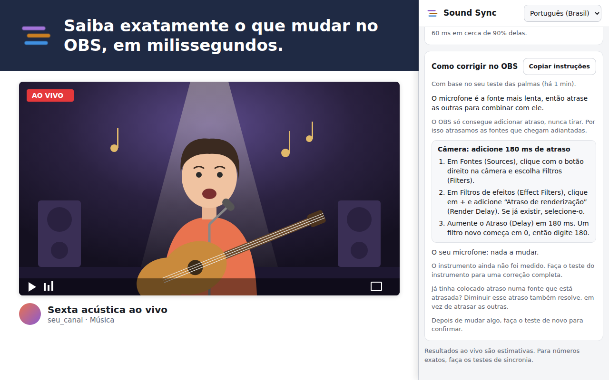
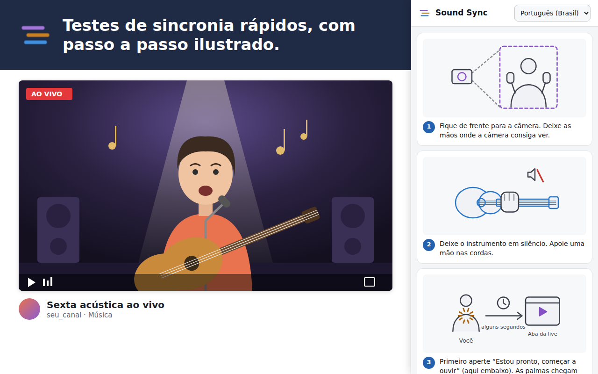

<div align="center">


# Sound Sync

**Sua live de música está sincronizada?**<br>
Descubra se a voz, os lábios, os instrumentos e a base de uma live estão alinhados, e veja o passo a passo para corrigir no OBS.

[](https://github.com/lucasbaesso/sound-sync/releases/latest)
[](LICENSE)


[English](README.md) · **🇧🇷 Português**

[**Baixar**](https://github.com/lucasbaesso/sound-sync/releases/latest) · [Instalar](#instalar) · [Como usar](#como-usar) · [Perguntas frequentes](#perguntas-frequentes)



</div>

## Por quê

Numa live de música, a câmera, o microfone, os instrumentos e a base passam por caminhos diferentes, e cada um pode chegar um pouco atrasado. Quem assiste percebe quando o canto não bate com os lábios, mas é difícil saber **o que** está atrasado e **quanto** enquanto você está tocando.

O Sound Sync assiste à sua live como um espectador, numa aba do navegador, e explica em palavras simples:

> *"A voz é ouvida 179 ms depois de os lábios se mexerem."*
> **Correção:** no OBS, adicione um Atraso de renderização de 180 ms na câmera.

## Recursos

| | |
|---|---|
| 🎤 **Voz e lábios ao vivo** | Acompanha a boca de quem canta e compara com a voz, enquanto a live toca. |
| 👏 **Teste das palmas** | Microfone x câmera, com precisão de cerca de um quadro de vídeo. |
| 🎸 **Teste do instrumento** | Entrada do instrumento x câmera, com uma batida nas cordas. |
| 🎧 **Teste da base** | Voz x base (playback), com uma faixa de cliques. Precisão de cerca de ±1 ms. |
| 🛠️ **Correções para o OBS** | Qual fonte atrasar (Atraso de renderização ou Deslocamento de sincronização) e em quantos milissegundos. Copie as instruções com um clique. |
| 🖼️ **Passo a passo ilustrado** | Cada teste mostra o que fazer com desenhos, em português e inglês. |
| 🔒 **Privado** | Tudo é analisado no seu computador. Sem conta, sem rastreamento, nada é enviado. |
| ⚙️ **Leve para o PC** | Escolha se ele pode usar a placa de vídeo, para não travar a live ou o jogo. |

Funciona com **Twitch, YouTube, TikTok, Instagram, Kick, Facebook** e qualquer aba com vídeo, ao vivo ou gravado. Também dá para verificar uma gravação do OBS abrindo o arquivo numa aba.

## Imagens

| | |
|:---:|:---:|
|  |  |
| **Como corrigir no OBS** | **Testes de sincronia ilustrados** |

<sub>A live nestas imagens é um desenho; o painel lateral é a extensão de verdade.</sub>

## Instalar

> O Sound Sync ainda não está na loja do Chrome nem do Edge. Até lá, instale pelo arquivo zip. Leva cerca de um minuto.

1. Baixe o **`sound-sync-<versão>.zip`** na [versão mais recente](https://github.com/lucasbaesso/sound-sync/releases/latest).
2. Descompacte numa pasta que você vai manter, por exemplo `Documentos\Sound Sync`. Não apague nem mova essa pasta depois: o navegador carrega a extensão a partir dela.
3. Abra `chrome://extensions` no Chrome, ou `edge://extensions` no Edge.
4. Ligue o **Modo do desenvolvedor**.
5. Clique em **Carregar sem compactação** e escolha a pasta onde está o arquivo `manifest.json`.
6. Clique no ícone 🧩 de quebra-cabeça na barra do navegador, fixe o **Sound Sync** e clique nele para abrir o painel lateral.

**Para atualizar:** baixe o zip novo, substitua os arquivos da sua pasta e clique em ↻ no Sound Sync em `chrome://extensions`.

## Como usar

1. **Abra a sua live** (ao vivo ou VOD) numa aba, na velocidade normal.
2. No painel lateral, clique em **Escolher a aba da transmissão**, escolha essa aba e deixe ligada a opção de compartilhar o áudio da guia.
3. O **Monitor** mostra resultados ao vivo depois de uns 20 segundos de canto na câmera.
4. Para números exatos, abra **Testes** e faça o teste das palmas, do instrumento ou da base durante a live (uma live de teste privada ou não listada serve).
5. Siga **Como corrigir no OBS** e faça o teste de novo para confirmar.

### O que "adiantado" e "atrasado" querem dizer

"Atrasado" quer dizer que chega depois do que deveria. Se a **voz está atrasada**, quem assiste vê os lábios se mexerem primeiro e ouve as palavras um instante depois. O OBS só consegue adicionar atraso, então o Sound Sync sempre manda **atrasar as fontes que chegam adiantadas** até tudo bater com a mais atrasada.

Os resultados são *som menos imagem*: **+** quer dizer que o som está atrasado, **−** que está adiantado. As pessoas percebem som adiantado mais rápido do que som atrasado.

| Resultado | Normalmente parece | O que fazer |
|---|---|---|
| −40 a +60 ms | Sincronizado | Nada |
| −90 a +125 ms | Um pouco fora | Corrija se puder |
| Além disso | Claramente fora de sincronia | Siga o passo a passo do OBS |

<sub>Os limites seguem as recomendações de transmissão EBU R37 e ITU-R BT.1359.</sub>

## Perguntas frequentes

<details>
<summary><b>Funciona do lado de quem assiste ou do meu?</b></summary>

Dos dois. Ele analisa o que a aba mostra, então mede o que os espectadores realmente recebem. Abra a sua própria live numa aba (no mesmo computador ou em outro) enquanto está ao vivo, ou abra um VOD depois.
</details>

<details>
<summary><b>Ele descobre sozinho se a minha voz está no tempo da base?</b></summary>

Não de forma confiável em poucos segundos: quando voz e música já estão misturadas numa faixa só, não dá para saber com segurança onde a pessoa queria cantar. Use o **teste da base** para ter um número exato. No Monitor há uma estimativa experimental que junta a live inteira (umas 12 músicas). A pesquisa por trás disso está em [reports/](reports/).
</details>

<details>
<summary><b>Ele deixa a live pesada?</b></summary>

Ele é leve, mas se o OBS ou um jogo travar, desligue **Usar a placa de vídeo (GPU)** em Ajuda → Desempenho. Lá também dá para desligar a separação de voz por IA. Rodar num segundo computador evita qualquer impacto.
</details>

<details>
<summary><b>Alguma coisa é enviada para a internet?</b></summary>

Não. Imagem, som, rastreamento do rosto e separação de voz são processados no seu computador. A extensão bloqueia qualquer requisição de rede. Veja a [política de privacidade](PRIVACY.md).
</details>

<details>
<summary><b>Por que ele pede para compartilhar uma aba?</b></summary>

É assim que uma extensão do navegador recebe a imagem e o som de uma aba. O próprio navegador pergunta qual aba compartilhar, e você pode parar quando quiser.
</details>

## Contribuir

Relatos de problemas e ideias são bem-vindos: [abra uma issue](https://github.com/lucasbaesso/sound-sync/issues) (pode ser em português). Para um problema de sincronia, diga qual site, se era ao vivo ou VOD, e o que o painel mostrou (um print ajuda).

Para compilar a partir do código, rodar os testes ou entender como as medições funcionam, veja **[docs/DEVELOPMENT.md](docs/DEVELOPMENT.md)** (em inglês).

```bash
git clone https://github.com/lucasbaesso/sound-sync.git
cd sound-sync
npm install
npm run fetch-models   # modelo do rosto e modelos de separação de voz
npm run build          # extensão em dist/, carregue com "Carregar sem compactação"
```

## Licença

[MIT](LICENSE) © Lucas Baesso. As bibliotecas e modelos incluídos também são de código aberto (Apache 2.0, MIT, BSD-3-Clause, ISC): veja [THIRD_PARTY_NOTICES.txt](public/THIRD_PARTY_NOTICES.txt).
